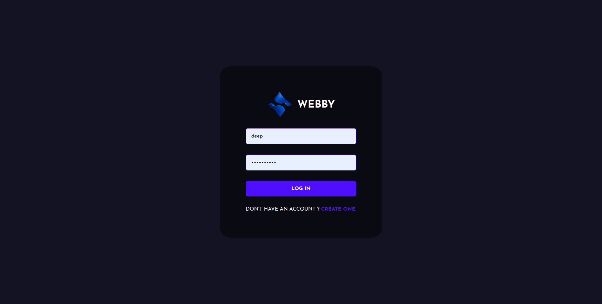

# webby - A Chat Application 
Webby is a simple and engaging web chat application built on the MERN (MongoDB, Express, React, Node.js) stack. It allows users to have live chat conversations, set avatars for their profiles, and send emojis, all within an attractive and user-friendly interface.



## Key Features
- Live Chat: Engage in real-time conversations with other users.
- Profile Avatars: Personalize your profile with custom avatars.
- Emoji Support: Express yourself with a wide range of emojis.
- User-Friendly UI: Enjoy an intuitive and visually appealing user interface.

## Getting started

### Requirements
- [Nodejs](https://nodejs.org/en/download)
- [Mongodb](https://www.mongodb.com/docs/manual/administration/install-community/)

Both should be installed and make sure mongodb is running.

```shell
git clone https://github.com/deeps36/webby.git
cd webby
```
Now rename env files from .env.example to .env
```shell
cd public
mv .env.example .env
cd ..
cd server
mv .env.example .env
cd ..
```

Now install the dependencies
```shell
cd server
yarn
cd ..
cd public
yarn
```
We are almost done, Now just start the development server.

For Frontend.
```shell
cd public
yarn start
```
For Backend.

Open another terminal in folder, Also make sure mongodb is running in background.
```shell
cd server
yarn start
```

Done! Now open localhost:3000 in your browser.